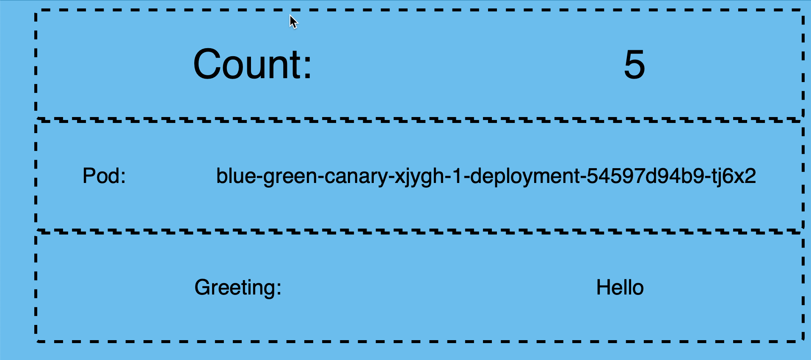
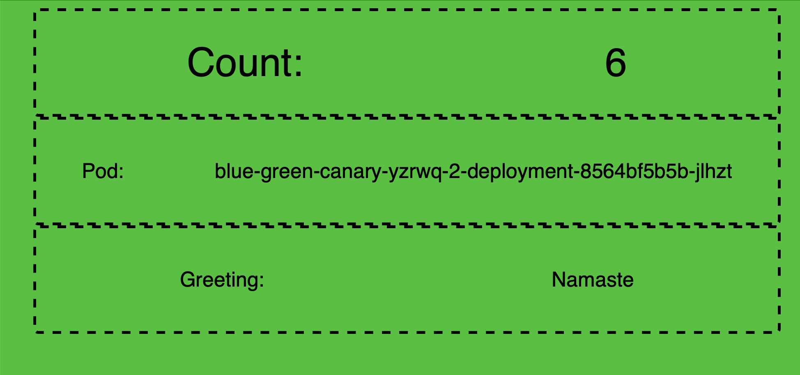
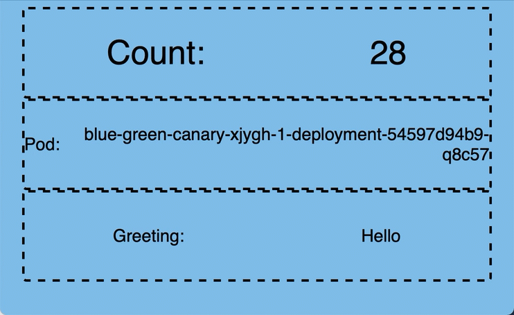

# Traffic Distribution

* Provide custom name to deployment
* Understanding advanced deployment techniques
* Apply blue-green deployment pattern
* Apply Canary Release Deployment pattern
* Reduce the service visibility

Knative always routes traffice to the *latest* revision of the service.  It is
possible to split the traffic amongst the available revisions.

### Deploy colors service

Explore /serving/colors-service-blue.yaml.

<tabs>
    <tab title="kn">
        <code-block lang="plain text">
            kn service create blue-green-canary \
               --image=quay.io/rhdevelopers/blue-green-canary \
               --env BLUE_GREEN_CANARY_COLOR="#6bbded" \
               --env BLUE_GREEN_CANARY_MESSAGE="Hello"
        </code-block>
    </tab>
    <tab title="kubectl">
        <code-block lang="plain text">
            kubectl apply -f colors-service-blue.yaml
        </code-block>
    </tab>
</tabs>

### Invoke the Service

Get the service URL:

````Bash
kn service describe blue-green-canary -o url
````

If the service was deployed correctly, we should be able to see blue background browser page,
with greeting as *Hello*.



### Deploy a New Revision of a Service

<h1 align="center">The 12 Factor App</h1>

[12factor.net ](https://12factor.net/)defines the twelve-factor app as a methodology for building software-as-a-service 
apps that:

* Use declarative formats for setup automation, to minimize time and cost for new developers joining the project;
* Have a clean contract with the underlying operating system, offering maximum portability between execution environments;
* Are suitable for deployment on modern cloud platforms, obviating the need for servers and systems administration;
* Minimize divergence between development and production, enabling continuous deployment for maximum agility;
* And can scale up without significant changes to tooling, architecture, or development practices.
* The twelve-factor methodology can be applied to apps written in any programming language, and which use any combination 
  of backing services (database, queue, memory cache, etc).

In line with 12-Factor principle, Knative rolls out new deployment whenever the Service Configuration changes, and 
creates immutable version of code and configuration called revision. An example of configuration change could for 
e.g. an update of Service image, a change to environment variables or add liveness/readiness probes.

Let us now change the configuration of the service by updating the service environment variable BLUE_GREEN_CANARY_COLOR 
to make the browser display green color with greeting text as Namaste.

<tabs>
    <tab title="kn">
        <code-block lang="plain text">
            kn service update blue-green-canary \
               --image=quay.io/rhdevelopers/blue-green-canary \
               --env BLUE_GREEN_CANARY_COLOR="#5bbf45" \
               --env BLUE_GREEN_CANARY_MESSAGE="Namaste"
        </code-block>
    </tab>
    <tab title="kubectl">
        <code-block lang="plain text">
            kubectl apply -f colors-service-green.yaml
        </code-block>
    </tab>
</tabs>

Invoke the Service

Get the service URL:

````Bash
kn service describe blue-green-canary -o url
````

If the service was deployed correctly, we should be able to see blue background browser page,
with greeting as *Hello*.



<tabs>
    <tab title="kn">
        <code-block lang="plain text">
            kn revision list
        </code-block>
    </tab>
    <tab title="kubectl">
        <code-block lang="plain text">
            kubectl get rev \
              --selector=serving.knative.dev/service=blue-green-canary \
              --sort-by="{.metadata.creationTimestamp}"
        </code-block>
    </tab>
</tabs>

### Tag Revisions

As you had observed that the Knative service blue-green-canary now has two revisions namely blue-green-canary-00001 
and blue-green-canary-00002. As the Revision names are autogenerated it is hard to comprehend to which code/configuration 
set it corresponds to. To overcome this problem Knative provides tagging of revision names that allows one to tag a 
revision name to a logical human understanable names called tags.

As our colors service shows different colors on the browser let us tag the revisions with color,

List the existing revisions,

````Bash
kn revision list -s blue-green-canary
````

When Knative rolls out a new revision, it increments the GENERATION by 1 and then routes 100% of the TRAFFIC to it, 
hence we can use the GENERATION or TRAFFIC to identify the latest revision.

### Tag Blue

````Bash
kn service update blue-green-canary --tag=blue-green-canary-00001=blue
````

### Tag Green

````Bash
kn service update blue-green-canary --tag=blue-green-canary-00002=green
````

### Tag Latest

````Bash
kn service update blue-green-canary --tag=@latest=latest
````

Query the Service revisions again:

````Bash
kn revision list -s blue-green-canary
````

As **green** happened to be the latest revision, it has been tagged with name ***latest*** in addition to ***green***.

We will use the tag names for easier identification of the revision and perform traffic distribution amongst them.

## Applying Blue-Green Deployment Pattern
Knative offers a simple way of switching 100% of the traffic from one Knative service revision (blue) to another newly 
rolled out revision (green). If the new revision (e.g. green) has erroneous behavior then it is easy to rollback the 
change.

In this exercise you will applying the Blue/Green deployment pattern with the Knative Service called greeter. 
You have already deployed two revisions of blue-green-canary identified using the tags blue and green.

With the deployment of green revision you noticed that Knative automatically started to routing 100% of the traffic to 
blue-green-canary-00002.

Now let us assume, due to a critical bug we need to roll back green to blue.

The following Knative Service YAML is identical to the previously deployed green except that we have added the traffic 
section to indicate that 100% of the traffic should be routed to blue.

Before you rollback the revision, refresh the browser window where you have opened the blue-green-canary service, to 
make sure it is still showing green browser page with greeting Namaste.

Now apply the update Knative service configuration using the command as shown in following listing:

### Rollback to Blue

````Bash
kn service update blue-green-canary --traffic blue=100, green=0, latest=0
````

> [!NOTE]
> We use the tag names to identify the revisions

List all the revisions with tags

````Bash
kn revision list
````

List the available sub-routes

````Bash
kubectl get ksvc blue-green-canary -oyaml \
 | yq r - 'status.traffic[].url'
````

The above command should return the three sub-routes for the main **greeter** route:

````Bash
http://latest-blue-green-canary.knativetutorial.192.168.64.13.nip.io 
http://blue-blue-green-canary.knativetutorial.192.168.64.13.nip.io 
http://green-blue-green-canary.knativetutorial.192.168.64.13.nip.io  
````

* the sub route for the traffic tag **latest**
* the sub route for the traffic tag **blue**
* the sub route for the traffic tag **green**

You will notice that the command does not create any new configuration/revision/deployment as there was no application 
update (e.g. image tag, env var, etc), but when you call the service, Knative scales up the **blue** that shows blue 
browser page with greeting **Hello**.


````Bash
kubectl get pods
````

Since **blue** is the active revision now, the existing **green** pod is getting terminated as no future requests will be
served by it.

> [!TIP]
> As an exercise, flip all the traffic back to **green** using kn command.

## Applying Canary Release Pattern
A Canary release is more effective when you want to reduce the risk of introducing new feature. It allows you a more effective feature-feedback loop before rolling out the change to your entire user base.

Knative allows you to split the traffic between revisions in increments as small as 1%.

To see this in action, apply the following Knative service definition that will split the traffic 80% to 20% between blue and green.

To roll out the greeter canary deployment use the following command:

````Bash
kn service update blue-green-canary \
  --traffic="blue=80" \
  --traffic="green=20"
````
As in the previous section on Applying Blue-Green Deployment Pattern deployments, the command will not create any new configuration/revision/deployment. To observe the traffic distribution, open the Service Route URL in your browser window.

You will notice the browser alternating betwee green and blue color, with majority of the time staying with blue.



We should also notice that two pods are running representing both **blue** and **green**.

````Bash
watch "kubectl get pods"
````
### Cleanup

````Bash
kn service delete blue-green-canary
````


